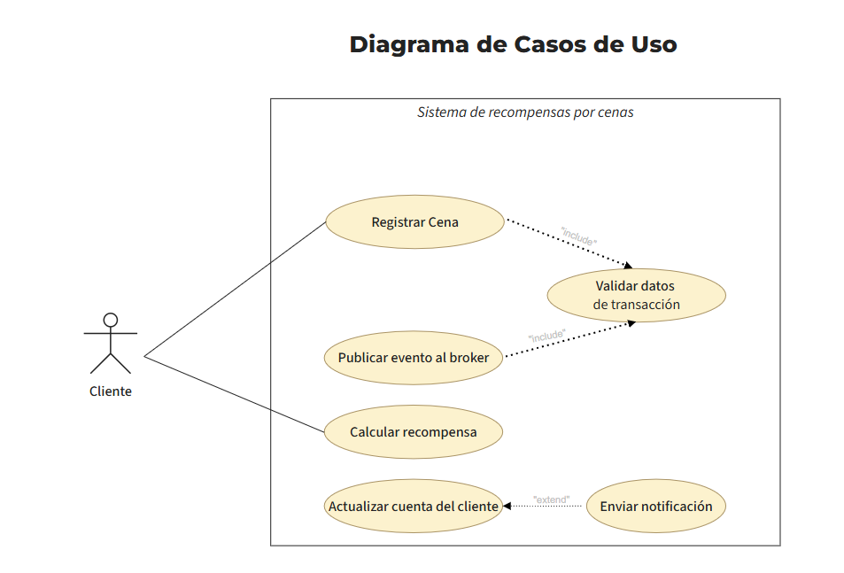
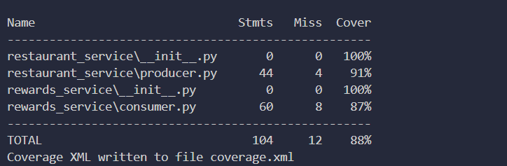

# Documento de Arquitectura - Sistema de Recompensas por Cenas

**Curso** Ingeniería de Software

**Reto** Buen diseño: Cohesión y Acoplamiento

---
## 1. Descripción General

El sistema implementa un programa de fidelización de restaurantes. Cada vez que un cliente realiza una cena en un restaurante afiliado, el sistema registra la transacción, la publica como evento en un broker de mensajería (RabbitMQ), y un microservicio independiente calcula y acumula los puntos o cashback del cliente.

---

## 2. Patrón Arquitectónico Utilizado

Para nuestro problema el más adecuado es Event-Driven Architecture (EDA) junto con Clean Architecture. Debido a que el problema:

- EDA
1. Tiene un flujo asíncroníco natural ya que el restaurante registra la cena y no necesita esperar a que se calcule los puntos para seguir atendiendo a otros clientes.

2. Se tendría un volumen de transacciones muy alto por naturaleza. con este patrón logramos que el broker absorba todos los picos y el consumidor procesa a su propio ritmo sin colapsar.

3. El productor y el consumidor tienen responsabilidades completamente distintas y no deberían reconocerse, el restaurante solo sabe que ocurrió una cena.

- Clean Architecture

1. EDA lo que va a resolver es el cómo se comunican entre sí los servicios. Pero dentro de cada servicio se necesita organizar el código.

2. La lógica de calcular los puntos no sabe nada de RabbitMQ, lo que permite hacer pruebas sin el broker real.

3. Podemos hacer pruebas sin necesidad de la conexión real al servidor de la universidad para funcionar.

---

## 3. Diagrama de Casos de Uso



---

## 4. Evidencia de pytest


---

## 5. Estructura del Proyecto

```
software-lab8/
├── restaurant_service/
│   ├── __init__.py
│   └── producer.py
├── rewards_service/
│   ├── __init__.py
│   └── consumer.py
├── tests/
│   ├── __init__.py
│   └── test_rewards.py
├── img/
├── requirements.txt
├── sonar-project.properties
└── README.md
```

---

## 6. Principios de Diseño Aplicados

- **Alta cohesión**  cada clase tiene una única responsabilidad.
- **Bajo acoplamiento**  producer y consumer no se conocen entre sí, se comunican solo a través de RabbitMQ.
- **Modularidad**  cada servicio es un paquete Python independiente.
- **Escalabilidad**  múltiples instancias del consumer pueden correr en paralelo sin cambiar el código.

---

## 7. Métricas de Calidad — SonarQube

| Métrica | Resultado | Requerido |
|---|---|---|
| Reliability | A | - |
| Security | A | - |
| Maintainability | A | - |
| Duplications | 0.0% | ≤ 2% |
| Coverage | 88.5% | ≥ 85% |

Enlace: https://sonarqube.ingsoftware.lat/dashboard?id=Anthony_Romero_t8

---

## 8. Instalación y Ejecución

```bash
# Instalar dependencias
pip install -r requirements.txt

# Correr tests
pytest tests/ --cov=restaurant_service --cov=rewards_service --cov-report=xml --cov-report=term -v

# Ejecutar producer
python restaurant_service/producer.py

# Ejecutar consumer
python rewards_service/consumer.py
```


